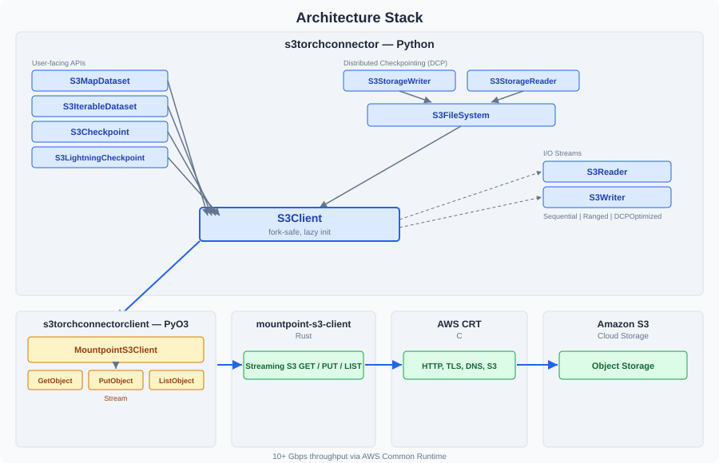
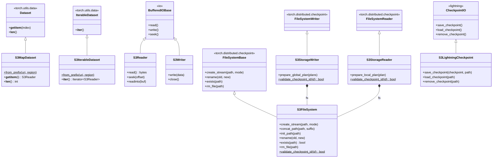
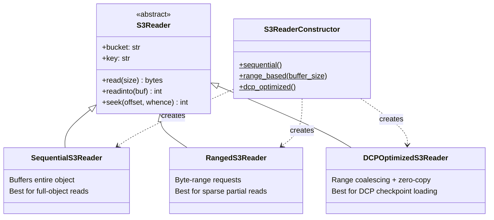

# Architecture Overview

The Amazon S3 Connector for PyTorch is **not a new S3 client**. It's a purpose-built bridge between
PyTorch's data loading and checkpointing interfaces and the high-performance
[mountpoint-s3-client](https://github.com/awslabs/mountpoint-s3) Rust library (built on the AWS Common Runtime).

It exists to deliver streaming, high-throughput S3 access (10+ Gbps) directly into PyTorch workflows —
without local disk staging, manual multipart handling, or GIL contention.

---

## Architecture Stack

| Layer | Role |
|-------|------|
| **s3torchconnector** (Python) | PyTorch-native interfaces — datasets, checkpoints, reader strategies, fork safety |
| **s3torchconnectorclient** (PyO3) | Thin bridge exposing the Rust S3 client as Python classes |
| **mountpoint-s3-client** (Rust) | Streaming S3 GET/PUT with automatic multipart, retries, connection pooling |
| **AWS CRT** (C) | Low-level HTTP, TLS, DNS, and S3 transfer primitives — auto-tunes parallelism |
| **Amazon S3** | Object storage service |

---

## How Rust Connects to Pythonv

The Rust layer is exposed to Python via [PyO3](https://pyo3.rs/) bindings. The key class is
`MountpointS3Client`, which provides `get_object`, `put_object`, `list_objects`, and other S3 operations.

**GIL release during I/O** — Every S3 call releases the Python Global Interpreter Lock, so Python
threads (including DataLoader workers) aren't blocked while waiting on network I/O.

**Streaming interfaces:**
- `GetObjectStream` — a Python iterator yielding ~8MB byte chunks from S3
- `PutObjectStream` — accepts `write()` calls, streaming data to S3 via multipart upload

**Fork safety for DataLoader workers** — PyTorch's DataLoader forks worker processes. The connector
detects PID changes on every S3 access and lazily re-creates the native client in the child process.
CRT background threads are cleaned up before fork via `os.register_at_fork`. This is automatic —
no user action required.

---

## Interface Mapping

| S3 Connector Class | Extends | Purpose |
|---|---|---|
| `S3MapDataset` | `torch.utils.data.Dataset` | Random access — eagerly lists objects, supports `__getitem__` |
| `S3IterableDataset` | `torch.utils.data.IterableDataset` | Streaming — lazy iteration with automatic sharding |
| `S3Reader` / `S3Writer` | `io.BufferedIOBase` | Drop-in compatible with `torch.save()` / `torch.load()` |
| `S3FileSystem` | `FileSystemBase` | S3 filesystem operations for DCP |
| `S3StorageWriter` | `FileSystemWriter` | Distributed checkpoint save to S3 |
| `S3StorageReader` | `FileSystemReader` | Distributed checkpoint load from S3 |
| `S3LightningCheckpoint` | `CheckpointIO` | PyTorch Lightning checkpoint plugin |

---

## Reader Hierarchy

The connector provides three reader strategies, selectable via `S3ReaderConstructor`:

| Reader | Strategy | Default for |
|--------|----------|-------------|
| **SequentialS3Reader** | Downloads and buffers the entire object; fast random access after first read | Datasets, simple checkpoints |
| **RangedS3Reader** | Byte-range requests; only fetches what's needed; adaptive 8MB buffer | Explicit opt-in for large sparse reads |
| **DCPOptimizedS3Reader** | Groups nearby byte ranges into single S3 requests; zero-copy via memoryview | `S3StorageReader` (automatic) |

For detailed reader configuration and usage examples, see the
[Reader Configurations](READER_CONFIGURATIONS.md) documentation.

---

## Key Design Decisions

### Why mountpoint-s3-client (not boto3)

boto3's transfer manager doesn't support true streaming — it downloads to disk or memory first.
mountpoint-s3-client provides native streaming GET/PUT built on the AWS CRT, delivering 10+ Gbps
throughput with automatic multipart, connection pooling, and retry logic.

### Why PyO3 (not ctypes/cffi)

PyO3 provides compile-time type safety, explicit GIL control (critical for releasing the GIL during
I/O), and native async support. ctypes/cffi would require manual memory management and offer no
GIL release mechanism.

### Why lazy client initialization

PyTorch's DataLoader forks worker processes. If the S3 client were initialized eagerly, CRT
background threads would be duplicated across forks — causing crashes or hangs. Lazy init (triggered
on first use) ensures each process creates its own client after fork.

### Why the reader_constructor pattern

Decouples the read strategy from the PyTorch interface. The same `S3MapDataset`, `S3Checkpoint`, or
`S3StorageReader` can use any reader strategy without code changes — just pass a different
`S3ReaderConstructor`. This also allows the DCP path to inject range metadata without modifying the
reader interface.

---

## Further Reading

- [README](../README.md) — Usage examples and getting started
- [Troubleshooting](TROUBLESHOOTING.md) — Common issues and solutions
- [API Documentation](https://awslabs.github.io/s3-connector-for-pytorch) — Full API reference
- [dev-docs/onboarding/](../dev-docs/onboarding/) — Deep internals for contributors
