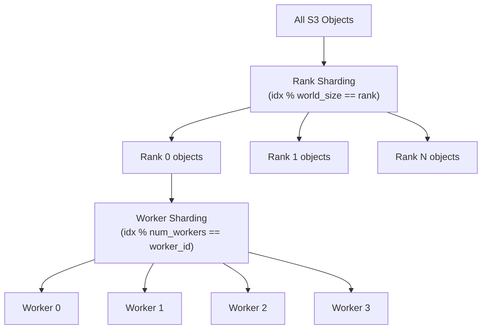

# Datasets

Amazon S3 Connector for PyTorch provides two dataset types that map directly to PyTorch's data loading primitives:

| Dataset | Base Class | Access Pattern | Listing Behavior |
|---------|-----------|----------------|------------------|
| `S3MapDataset` | `torch.utils.data.Dataset` | Random access (`__getitem__`) | Eager — lists all objects on first access |
| `S3IterableDataset` | `torch.utils.data.IterableDataset` | Sequential streaming (`__iter__`) | Lazy — iterates without full listing |

Choose **S3MapDataset** when you need random access or know the dataset size upfront (e.g., for samplers).  
Choose **S3IterableDataset** when streaming sequentially or working with very large object lists.

---

## S3MapDataset

`S3MapDataset` extends `torch.utils.data.Dataset` and supports `__getitem__` and `__len__`. It eagerly lists all objects under the given prefix on first access to any element or on the first call to `len()`.

> **Note:** The initial listing may take time for large prefixes and may appear unresponsive.

### Creating from a prefix

```python
from s3torchconnector import S3MapDataset

DATASET_URI = "s3://my-bucket/training-data/"
REGION = "us-east-1"

dataset = S3MapDataset.from_prefix(DATASET_URI, region=REGION)

print(len(dataset))  # triggers listing
item = dataset[0]    # random access
```

### Creating from explicit object URIs

```python
from s3torchconnector import S3MapDataset

object_uris = [
    "s3://my-bucket/data/sample_001.npz",
    "s3://my-bucket/data/sample_002.npz",
    "s3://my-bucket/data/sample_003.npz",
]

dataset = S3MapDataset.from_objects(object_uris, region="us-east-1")
```

### Accessing item properties

Each item returned by the dataset is an `S3Reader` object:

```python
item = dataset[0]

bucket = item.bucket   # S3 bucket name
key = item.key         # Object key
content = item.read()  # Full object content as bytes
```

---

## S3IterableDataset

`S3IterableDataset` extends `torch.utils.data.IterableDataset` and yields objects lazily as you iterate — no upfront listing required.

### Creating from a prefix

```python
from s3torchconnector import S3IterableDataset

DATASET_URI = "s3://my-bucket/training-data/"
REGION = "us-east-1"

dataset = S3IterableDataset.from_prefix(DATASET_URI, region=REGION)

for item in dataset:
    print(item.key)
    content = item.read()
```

### Creating from explicit object URIs

```python
from s3torchconnector import S3IterableDataset

object_uris = [
    "s3://my-bucket/data/sample_001.npz",
    "s3://my-bucket/data/sample_002.npz",
]

dataset = S3IterableDataset.from_objects(object_uris, region="us-east-1")
```

---

## S3 Express One Zone

Both datasets work with [Amazon S3 Express One Zone](https://docs.aws.amazon.com/AmazonS3/latest/userguide/s3-express-one-zone.html) directory buckets. Use the directory bucket URI format:

```
s3://base-name--azid--x-s3/prefix/
```

> **Important:** The prefix for S3 Express One Zone **must end with `/`**.

```python
from s3torchconnector import S3MapDataset

# Directory bucket in us-west-2, Availability Zone usw2-az1
DATASET_URI = "s3://my-training-bucket--usw2-az1--x-s3/datasets/imagenet/"
REGION = "us-west-2"

dataset = S3MapDataset.from_prefix(DATASET_URI, region=REGION)
```

---

## Data Flow


---

## Custom Transforms

Both datasets accept a `transform` callable that converts the raw `S3Reader` into your desired format. The transform receives an `S3Reader` and can return any type.

```python
import io
from PIL import Image
from torchvision import transforms
from s3torchconnector import S3MapDataset

preprocess = transforms.Compose([
    transforms.Resize(256),
    transforms.CenterCrop(224),
    transforms.ToTensor(),
    transforms.Normalize(mean=[0.485, 0.456, 0.406], std=[0.229, 0.224, 0.225]),
])

def load_image(s3reader):
    return preprocess(Image.open(io.BytesIO(s3reader.read())).convert("RGB"))

dataset = S3MapDataset.from_prefix(
    "s3://my-bucket/images/",
    region="us-east-1",
    transform=load_image,
)

# Each item is now a preprocessed tensor
tensor = dataset[0]
```

---

## Parallel and Distributed Training

### S3IterableDataset with sharding

Enable automatic sharding across distributed ranks and DataLoader workers with `enable_sharding=True`:

```python
from s3torchconnector import S3IterableDataset
from torch.utils.data import DataLoader

dataset = S3IterableDataset.from_prefix(
    "s3://my-bucket/training-data/",
    region="us-east-1",
    enable_sharding=True,
)

dataloader = DataLoader(dataset, num_workers=4)
```

When sharding is enabled, objects are distributed using two-level modulo assignment:

1. **Rank-level:** `object_index % world_size == rank`
2. **Worker-level:** `rank_local_index % num_workers == worker_id`



Each worker across all ranks processes a unique, non-overlapping subset of the dataset.

### S3MapDataset with DistributedSampler

For map-style datasets, use PyTorch's `DistributedSampler` to partition indices across ranks:

```python
from s3torchconnector import S3MapDataset
from torch.utils.data import DataLoader
from torch.utils.data.distributed import DistributedSampler

dataset = S3MapDataset.from_prefix(
    "s3://my-bucket/training-data/",
    region="us-east-1",
)

sampler = DistributedSampler(dataset)
dataloader = DataLoader(dataset, sampler=sampler, num_workers=4)
```

---

## Reader Selection for Datasets

By default, datasets use the **Sequential reader**, which downloads and buffers the entire S3 object in memory. This is optimal for most training workloads where you read the full object.

For large objects (100MB+) where you only need partial reads, use the **Range-based reader**:

```python
from s3torchconnector import S3MapDataset, S3ReaderConstructor

dataset = S3MapDataset.from_prefix(
    "s3://my-bucket/large-objects/",
    region="us-east-1",
    reader_constructor=S3ReaderConstructor.range_based(),
)
```

See [READER_CONFIGURATIONS.md](READER_CONFIGURATIONS.md) for full details on reader types and when to use each.

---

## Configuration

Both datasets accept an `s3client_config` parameter for customizing S3 client behavior (profiles, throughput targets, etc.):

```python
from s3torchconnector import S3MapDataset, S3ClientConfig

config = S3ClientConfig(profile="custom-profile")

dataset = S3MapDataset.from_prefix(
    "s3://my-bucket/data/",
    region="us-east-1",
    s3client_config=config,
)
```

See [CONFIGURATION.md](CONFIGURATION.md) for all available configuration options.
