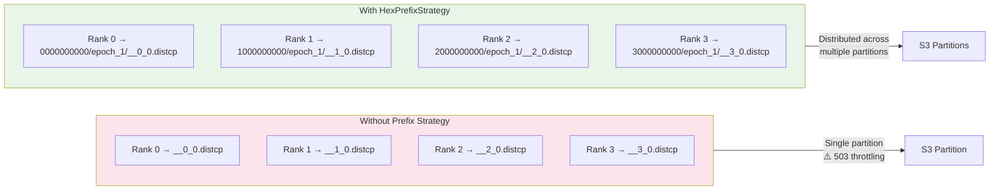
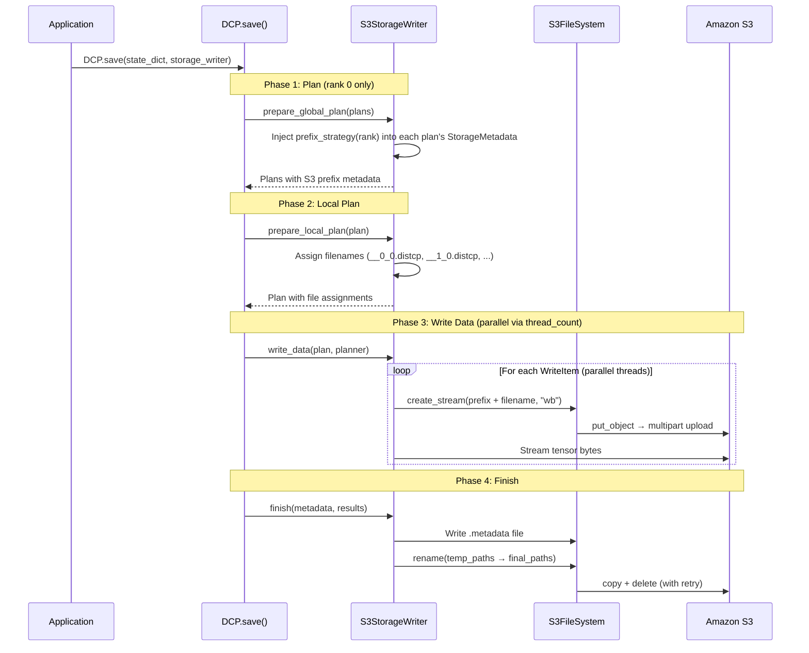
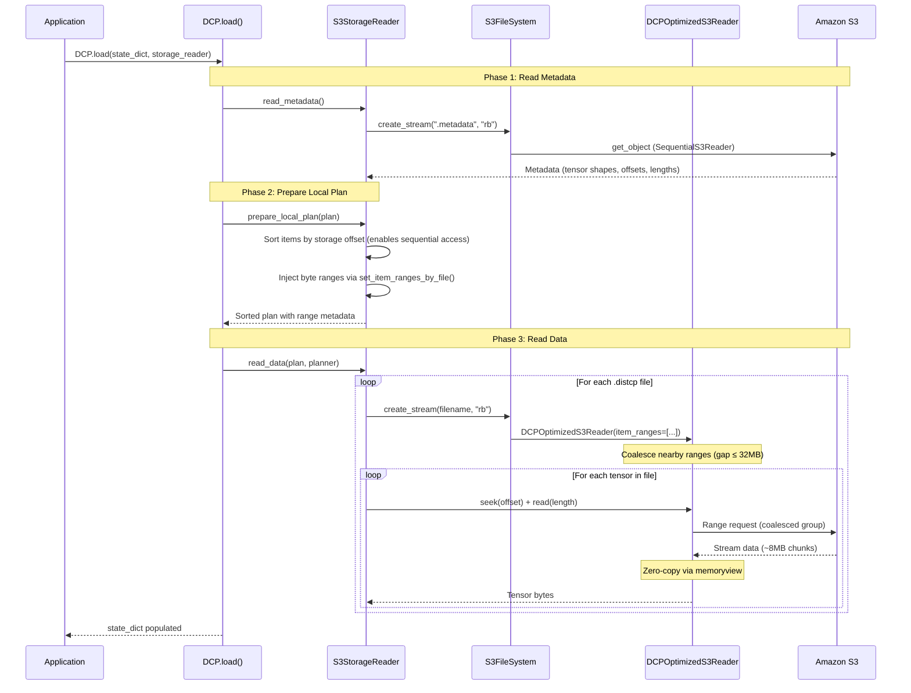

# Distributed Checkpoints with Amazon S3

This guide covers using PyTorch Distributed Checkpoints (DCP) with the S3 Connector for PyTorch, including `S3StorageWriter`, `S3StorageReader`, and prefix strategies for optimized checkpoint organization.

## Table of Contents

- [Overview](#overview)
- [Prerequisites and Installation](#prerequisites-and-installation)
- [Basic Usage](#basic-usage)
- [S3 Prefix Strategies](#s3-prefix-strategies)
- [DCP Save Flow](#dcp-save-flow)
- [DCP Load Flow](#dcp-load-flow)
- [Reader Configuration for DCP](#reader-configuration-for-dcp)
- [End-to-end Examples](#end-to-end-examples)

---

## Overview

[PyTorch Distributed Checkpoints (DCP)](https://pytorch.org/docs/stable/distributed.checkpoint.html) is a framework for saving and loading sharded model state across multiple processes in distributed training. Unlike simple checkpointing (which serializes the entire model on a single rank), DCP enables each rank to save its own shard in parallel — critical for large models using FSDP or DDP.

The S3 Connector for PyTorch provides native DCP integration through:

- **`S3StorageWriter`** — Streams checkpoint shards directly to S3 with parallel IO threads
- **`S3StorageReader`** — Loads checkpoints from S3 using optimized range-based reads
- **`S3FileSystem`** — S3-backed implementation of PyTorch's `FileSystemBase`

This eliminates the need for local disk staging, enabling direct GPU-memory-to-S3 checkpoint streaming.

---

## Prerequisites and Installation

- **PyTorch 2.3 or newer (excluding 2.5.0)** is required for DCP support
- AWS credentials configured (see [Configuration](CONFIGURATION.md))

Install with the `dcp` extra:

```sh
pip install s3torchconnector[dcp]
```

---

## Basic Usage

### Saving a Distributed Checkpoint

```python
from s3torchconnector.dcp import S3StorageWriter
import torch.distributed.checkpoint as DCP
import torchvision

CHECKPOINT_URI = "s3://<BUCKET>/<KEY>/"
REGION = "us-east-1"

model = torchvision.models.resnet18()

s3_storage_writer = S3StorageWriter(
    region=REGION,
    path=CHECKPOINT_URI,
    thread_count=8,  # Number of parallel IO threads for writing
)

DCP.save(
    state_dict=model.state_dict(),
    storage_writer=s3_storage_writer,
)
```

The `thread_count` parameter controls how many IO threads write tensor data in parallel. Higher values improve throughput for large checkpoints (recommend 8+).

### Loading a Distributed Checkpoint

```python
from s3torchconnector.dcp import S3StorageReader
import torch.distributed.checkpoint as DCP
import torchvision

CHECKPOINT_URI = "s3://<BUCKET>/<KEY>/"
REGION = "us-east-1"

model = torchvision.models.resnet18()
model_state_dict = model.state_dict()

s3_storage_reader = S3StorageReader(
    region=REGION,
    path=CHECKPOINT_URI,
)

DCP.load(
    state_dict=model_state_dict,
    storage_reader=s3_storage_reader,
)

model.load_state_dict(model_state_dict)
```

`S3StorageReader` uses `DCPOptimizedS3Reader` by default, which provides range coalescing and zero-copy buffer management for faster checkpoint loading.

---

## S3 Prefix Strategies

### Why Prefix Strategies?

S3 partitions objects by key prefix. When many distributed training ranks write checkpoints simultaneously to the same prefix, the concentrated writes can cause **503 Slow Down** throttling errors.

Prefix strategies distribute checkpoint keys across multiple S3 partitions by injecting varied prefixes, following [AWS best practices for optimizing S3 performance](https://docs.aws.amazon.com/AmazonS3/latest/userguide/optimizing-performance.html).



### Available Strategies

All strategies inherit from `S3PrefixStrategyBase` and implement `generate_prefix(rank: int) -> str`.

#### DefaultPrefixStrategy

Used when no strategy is specified. Produces simple rank-based names without distribution.

```python
# Output: __0_, __1_, __2_, ...
```

#### RoundRobinPrefixStrategy

Distributes ranks across user-provided prefixes in round-robin fashion.

```python
from s3torchconnector.dcp.s3_prefix_strategy import RoundRobinPrefixStrategy, S3StorageWriter

strategy = RoundRobinPrefixStrategy(
    user_prefixes=["shard1", "shard2", "shard3"],
    epoch_num=5,  # Optional: for checkpoint versioning
)

writer = S3StorageWriter(
    region=REGION,
    path=CHECKPOINT_URI,
    prefix_strategy=strategy,
    thread_count=8,
)

DCP.save(state_dict=model.state_dict(), storage_writer=writer)
```

Output structure:
```
CHECKPOINT_URI/
├── shard1/epoch_5/__0_0.distcp
├── shard2/epoch_5/__1_0.distcp
├── shard3/epoch_5/__2_0.distcp
├── shard1/epoch_5/__3_0.distcp   ← wraps around
└── ...
```

#### BinaryPrefixStrategy

Generates reversed binary (base-2) prefixes for optimal partition distribution.

```python
from s3torchconnector.dcp import BinaryPrefixStrategy, S3StorageWriter

strategy = BinaryPrefixStrategy(
    epoch_num=1,            # Optional
    min_prefix_length=10,   # Minimum prefix length (default: 10)
    prefix_count=None,      # Defaults to world size
)

writer = S3StorageWriter(
    region=REGION,
    path=CHECKPOINT_URI,
    prefix_strategy=strategy,
)
```

Output structure:
```
CHECKPOINT_URI/
├── 0000000000/epoch_1/__0_0.distcp
├── 1000000000/epoch_1/__1_0.distcp
├── 0100000000/epoch_1/__2_0.distcp
├── 1100000000/epoch_1/__3_0.distcp
└── ...
```

#### HexPrefixStrategy

Uses reversed hexadecimal (base-16) prefixes for a balance of distribution efficiency and readability.

```python
from s3torchconnector.dcp import HexPrefixStrategy, S3StorageWriter

strategy = HexPrefixStrategy(
    epoch_num=1,            # Optional
    min_prefix_length=4,    # Minimum prefix length (default: 10)
    prefix_count=None,      # Defaults to world size
)

writer = S3StorageWriter(
    region=REGION,
    path=CHECKPOINT_URI,
    prefix_strategy=strategy,
)
```

Output structure:
```
CHECKPOINT_URI/
├── 0000/epoch_1/__0_0.distcp
├── 1000/epoch_1/__1_0.distcp
├── 2000/epoch_1/__2_0.distcp
...
├── f000/epoch_1/__15_0.distcp
└── ...
```

### Creating Custom Strategies

Extend `S3PrefixStrategyBase` and implement `generate_prefix`:

```python
from s3torchconnector.dcp import S3PrefixStrategyBase

class CustomPrefixStrategy(S3PrefixStrategyBase):
    def __init__(self, custom_param: str):
        super().__init__()
        self.custom_param = custom_param

    def generate_prefix(self, rank: int) -> str:
        return f"custom_{self.custom_param}/{rank}/"
```

### Strategy Parameters Reference

| Strategy | Parameters | Description |
|----------|-----------|-------------|
| `DefaultPrefixStrategy` | — | Simple `__<rank>_` prefix |
| `BinaryPrefixStrategy` | `epoch_num`, `min_prefix_length` (default: 10), `prefix_count` | Reversed binary prefixes |
| `HexPrefixStrategy` | `epoch_num`, `min_prefix_length` (default: 10), `prefix_count` | Reversed hex prefixes |
| `RoundRobinPrefixStrategy` | `user_prefixes` (required), `epoch_num` | Round-robin across user-defined prefixes |

> **Note**: For `BinaryPrefixStrategy` and `HexPrefixStrategy`, `prefix_count` defaults to the distributed world size (`torch.distributed.get_world_size()`) when `torch.distributed` is initialized, otherwise defaults to 1.

---

## DCP Save Flow



Key details:
- **`prepare_global_plan`** runs only on rank 0 and injects the prefix strategy into each plan's `StorageMetadata`
- **`write_data`** uses `thread_count` parallel IO threads to stream tensors to S3
- **`finish`** writes the `.metadata` file (containing tensor shapes, offsets, and lengths) and renames temp files to final paths via copy + delete with exponential backoff retry

---

## DCP Load Flow



Key details:
- **`prepare_local_plan`** sorts items by offset and injects range metadata — both are required for `DCPOptimizedS3Reader`
- The `.metadata` file is always read with `SequentialS3Reader` (full file needed for deserialization)
- `.distcp` files use `DCPOptimizedS3Reader` with pre-computed `ItemRange` lists for selective fetching

---

## Reader Configuration for DCP

### Default: DCPOptimizedS3Reader

`S3StorageReader` uses `DCPOptimizedS3Reader` by default, which provides:

- **Selective fetching** — Only downloads byte ranges containing requested tensors
- **Range coalescing** — Groups nearby ranges (gap ≤ 32MB) into single S3 requests
- **Zero-copy buffers** — Uses `memoryview` segments to avoid intermediate allocations
- **Per-item lifecycle** — Discards buffer after each tensor, keeping memory bounded

```python
from s3torchconnector import S3ReaderConstructor
from s3torchconnector.dcp import S3StorageReader

# Explicit (same as default):
reader = S3StorageReader(
    region=REGION,
    path=CHECKPOINT_URI,
    reader_constructor=S3ReaderConstructor.dcp_optimized(),
)
```

### Fallback: Sequential Reader

If you encounter issues with `DCPOptimizedS3Reader`, fall back to the sequential reader:

```python
reader = S3StorageReader(
    region=REGION,
    path=CHECKPOINT_URI,
    reader_constructor=S3ReaderConstructor.sequential(),
)
```

This downloads entire `.distcp` files but avoids range-based access patterns that may fail in edge cases.

### Further Reading

- [Reader Configurations](READER_CONFIGURATIONS.md) — Detailed comparison of all reader types
- [Troubleshooting: DCPOptimizedS3Reader Errors](TROUBLESHOOTING.md#dcpoptimizeds3reader-errors) — Common issues and solutions

---

## End-to-end Examples

Complete working examples for distributed checkpoints with S3 are available in the [`examples/dcp/`](../examples/dcp) directory, including:

- FSDP (Fully Sharded Data Parallel) save and load
- DDP (Distributed Data Parallel) checkpointing
- Prefix strategy usage with multi-node training
