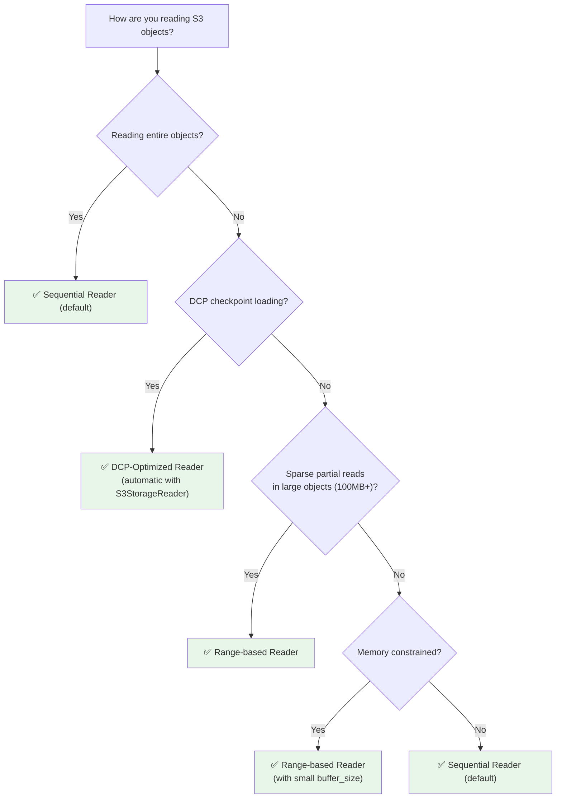
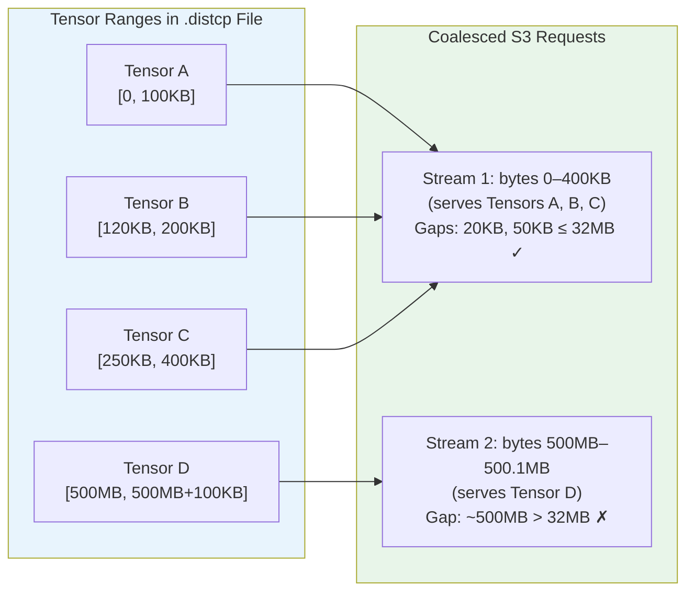

# Reader Configurations

Amazon S3 Connector for PyTorch supports three reader types, each optimized for different access patterns. This guide helps you choose the right reader and configure it for your workload.

## Choosing a Reader



## Comparison

| Feature | Sequential | Range-based | DCP-Optimized |
|---------|-----------|-------------|---------------|
| **Buffering** | Entire object | Configurable (default 8MB) | Per-item |
| **Memory usage** | High (full object) | Low (buffer only) | Optimal (discard after each tensor) |
| **Access pattern** | Any | Any | Sequential only |
| **Zero-copy** | No | Yes (`readinto`) | Yes (memoryview segments) |
| **Default for** | Datasets, S3Checkpoint | Explicit opt-in | S3StorageReader (DCP) |
| **Best use case** | Full-object reads, repeated access | Sparse partial reads in 100MB+ objects | DCP checkpoint loading |

---

## Sequential Reader

The default reader for all non-DCP use cases. Downloads and buffers the entire S3 object in memory on first access.

**When to use:**
- Reading entire objects (training data, full checkpoints)
- Repeated access to the same data (random seeks after initial download)
- General-purpose workloads where simplicity is preferred

**Behavior:**
- Lazily streams data into an in-memory buffer as positions are read or seeked to. After a full `read()`, the entire object is buffered
- Subsequent reads are served from the buffer with no additional S3 requests
- Supports random access (seek to any position after download)

**Configuration:** None required — this is the default.

```python
from s3torchconnector import S3MapDataset, S3ReaderConstructor

# Sequential is already the default; explicit for clarity
dataset = S3MapDataset.from_prefix(
    DATASET_URI, 
    region=REGION,
    reader_constructor=S3ReaderConstructor.sequential()
)

for item in dataset:
    content = item.read()  # Full object buffered in memory
```

---

## Range-based Reader

Performs byte-range requests to read specific portions of S3 objects without downloading the entire file. Prioritizes memory efficiency over throughput.

**When to use:**
- Large objects (100MB+) where you only need specific byte ranges
- Memory-constrained environments
- Sparse partial reads (e.g., reading headers or specific offsets)

**Behavior:**
- **Small reads** (< `buffer_size`): Fetches `buffer_size` bytes into an internal buffer to reduce S3 API calls for sequential small reads
- **Large reads** (≥ `buffer_size`): Bypasses the buffer for direct transfer from S3
- **Forward overlap**: Reuses buffered data when a read extends beyond the current buffer

**Parameters:**

| Parameter | Default | Description |
|-----------|---------|-------------|
| `buffer_size` | `8388608` (8MB) | Internal buffer size. Set to `0` to disable buffering. `None` uses the default. |

**Configuration guide:**
- Use larger buffer sizes for workloads with many small, sequential reads
- Use smaller buffer sizes or `0` for sparse partial reads across large offsets
- Disable buffering (`buffer_size=0`) for zero-copy `readinto()` into pre-allocated buffers

```python
from s3torchconnector._s3client import S3Client
from s3torchconnector import S3ReaderConstructor

s3_client = S3Client(region="us-east-1")

# Zero-copy partial read into a pre-allocated buffer
reader_constructor = S3ReaderConstructor.range_based(buffer_size=0)
s3reader = s3_client.get_object(
    bucket="my-bucket", 
    key="large_object.bin", 
    reader_constructor=reader_constructor
)

buffer = bytearray(10 * 1024 * 1024)  # 10MB pre-allocated
s3reader.seek(100 * 1024 * 1024)       # Skip to 100MB offset
bytes_read = s3reader.readinto(buffer)  # Direct read, no intermediate copy
```

---

## DCP-Optimized Reader

The default reader for `S3StorageReader` when loading PyTorch Distributed Checkpoints. Provides performance improvements through selective data fetching with range coalescing and zero-copy buffer management.

**When to use:**
- PyTorch Distributed Checkpoint (DCP) loading — **automatic, no configuration needed**
- Partial checkpoint loading (e.g., loading only model weights, skipping optimizer state)

**Behavior:**
- Groups nearby byte ranges into single S3 requests (range coalescing)
- Uses per-item buffers with `memoryview` segments (zero-copy)
- Discards each buffer after the tensor is read, keeping memory bounded
- Requires sequential access (automatically enforced by `S3StorageReader.prepare_local_plan()`)

**Parameters:**

| Parameter | Default | Description |
|-----------|---------|-------------|
| `max_gap_size` | `33554432` (32MB) | Maximum gap between ranges to coalesce into one S3 stream. Use `float("inf")` to coalesce all ranges. Use `0` to disable coalescing. |

### Range Coalescing

When loading a checkpoint, tensors are stored at various byte offsets within `.distcp` files. Rather than making one S3 request per tensor, the DCP-optimized reader groups nearby ranges into single requests:



Ranges with gaps ≤ `max_gap_size` (32MB default) share a single S3 stream. Larger gaps start a new stream. This balances reducing S3 request overhead against downloading unnecessary gap data.

**Usage:** The DCP-optimized reader is the default for `S3StorageReader` — no explicit configuration is needed:

```python
from s3torchconnector.dcp import S3StorageReader
import torch.distributed.checkpoint as DCP

# dcp_optimized is already the default
s3_storage_reader = S3StorageReader(
    region="us-east-1", 
    path="s3://bucket/checkpoints/",
)
DCP.load(
    state_dict=model_state_dict,
    storage_reader=s3_storage_reader,
)
```

For more DCP usage examples, see [Distributed Checkpoints](DISTRIBUTED_CHECKPOINTS.md).

---

## Usage Examples

### S3MapDataset with Sequential Reader (default)

```python
from s3torchconnector import S3MapDataset, S3ReaderConstructor

dataset = S3MapDataset.from_prefix(
    "s3://my-bucket/training-data/", 
    region="us-east-1",
    reader_constructor=S3ReaderConstructor.sequential()  # default, explicit for clarity
)

for item in dataset:
    content = item.read()
```

### S3Client with Range-based Reader

```python
from s3torchconnector._s3client import S3Client
from s3torchconnector import S3ReaderConstructor

s3_client = S3Client(region="us-east-1")

# With default 8MB buffer for sequential small reads
reader = s3_client.get_object(
    bucket="my-bucket",
    key="large_file.bin",
    reader_constructor=S3ReaderConstructor.range_based()
)
reader.seek(1024 * 1024 * 50)  # Seek to 50MB
data = reader.read(4096)        # Small read served from buffer

# With no buffer for direct transfer
reader = s3_client.get_object(
    bucket="my-bucket",
    key="large_file.bin",
    reader_constructor=S3ReaderConstructor.range_based(buffer_size=0)
)
buf = bytearray(10 * 1024 * 1024)
reader.seek(100 * 1024 * 1024)
bytes_read = reader.readinto(buf)
```

### S3StorageReader with DCP-Optimized Reader (default)

```python
from s3torchconnector.dcp import S3StorageReader
from s3torchconnector import S3ReaderConstructor
import torch.distributed.checkpoint as DCP

# Default — no configuration needed
s3_storage_reader = S3StorageReader(
    region="us-east-1",
    path="s3://bucket/checkpoints/",
)

# Or explicitly with custom max_gap_size
s3_storage_reader = S3StorageReader(
    region="us-east-1",
    path="s3://bucket/checkpoints/",
    reader_constructor=S3ReaderConstructor.dcp_optimized(
        max_gap_size=64 * 1024 * 1024  # 64MB gap tolerance
    ),
)

DCP.load(state_dict=model_state_dict, storage_reader=s3_storage_reader)
```

---

## Thread Safety

> **S3Reader instances are NOT thread-safe** and should not be shared across threads.

For multiprocessing with PyTorch's `DataLoader`, each worker process creates its own `S3Reader` instance automatically — no user action is required. The connector's fork-safety mechanism ensures that native S3 clients are properly re-initialized in each worker process.

```python
# Safe — each worker gets its own reader instances
dataloader = DataLoader(dataset, num_workers=8)
```

---

## API Reference

### `S3ReaderConstructor.sequential()`

Creates a constructor for sequential readers that buffer the entire object.

- **Parameters:** None
- **Returns:** `S3ReaderConstructorProtocol`

### `S3ReaderConstructor.range_based(buffer_size=None)`

Creates a constructor for range-based readers that fetch specific byte ranges.

- **Parameters:**
  - `buffer_size` (`Optional[int]`): Internal buffer size in bytes. `None` uses default (8MB). Set to `0` to disable buffering.
- **Returns:** `S3ReaderConstructorProtocol`

### `S3ReaderConstructor.dcp_optimized(max_gap_size=33554432)`

Creates a constructor for DCP-optimized readers with range coalescing.

- **Parameters:**
  - `max_gap_size` (`Union[int, float]`): Maximum gap in bytes between ranges to coalesce. Default: 32MB. Use `float("inf")` to coalesce all ranges. Use `0` to disable coalescing.
- **Returns:** `DCPS3ReaderConstructorProtocol` (used by `S3StorageReader`)

---

For full API documentation, see the [S3ReaderConstructor reference](https://awslabs.github.io/s3-connector-for-pytorch/autoapi/s3torchconnector/s3reader/constructor/index.html).
